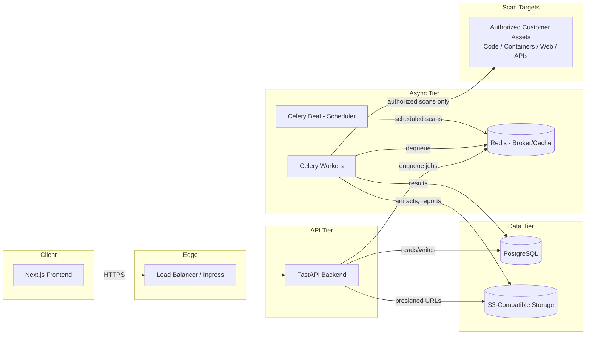

# SentinelX Architecture

## 1. Overview

SentinelX is a multi-tenant SaaS platform that orchestrates security
scanning engines and presents unified findings, risk scores, and reports to
customers. The platform is split into a stateless API layer, an
asynchronous worker fleet that runs scan jobs, and a Next.js frontend.

## 2. Components

### 2.1 Frontend (`frontend/`)

- **Next.js (App Router) + TypeScript** — server components for data-heavy
  views, client components for interactivity.
- **Tailwind CSS + shadcn/ui** — design system primitives, themeable, no
  runtime CSS-in-JS overhead.
- **React Query** — server-state caching, request deduplication, and
  optimistic updates against the FastAPI backend.

### 2.2 Backend API (`backend/app`)

- **FastAPI on Python 3.13**, served by Uvicorn (ASGI) behind Gunicorn-style
  process management in production.
- Organized by layer: `api` (HTTP boundary), `services` (application logic,
  added incrementally), `models` (SQLAlchemy ORM), `schemas` (Pydantic I/O
  contracts), `core` (config, logging, security primitives), `db`
  (session/engine management).
- Versioned under `/api/v1`; new breaking changes ship under `/api/v2`
  rather than mutating v1 contracts.
- Domain capabilities (source code scanning, secret detection, dependency
  analysis, container scanning, website scanning, API scanning,
  authenticated testing, penetration testing, AI business-logic testing,
  continuous monitoring, reporting) each live in their own module under
  `backend/app/modules/`, so scan engines can be developed, tested, and
  scaled independently.

### 2.3 Asynchronous workers (`backend/app/workers`)

- **Celery** workers execute scan jobs, report generation, and scheduled
  tasks outside the request/response cycle.
- **Redis** is the message broker and result backend, and doubles as the
  application cache.
- **Celery Beat** drives continuous monitoring (recurring/scheduled scans).
- **Flower** provides operational visibility into the worker fleet.
- Scan engines that need process isolation (e.g. running untrusted
  analyzers against customer code) execute inside short-lived, resource
  constrained **Docker** containers launched by the worker.

### 2.4 Data tier

- **PostgreSQL** is the system of record: tenants, users, assets, scan
  configurations, findings, and reports.
- **S3-compatible object storage** (MinIO locally; AWS S3, GCS, or
  Cloudflare R2 in production) holds scan artifacts, raw tool output, and
  generated PDF/CSV reports, referenced from Postgres by key.
- **Redis** is used for caching, rate limiting counters, and as the Celery
  broker/result backend — it is not a system of record.

### 2.5 AuthN / AuthZ

- **JWT** access tokens (short-lived) authenticate API requests.
- **Refresh tokens** (long-lived, rotated, revocable) issue new access
  tokens without re-prompting for credentials.
- **OAuth2** authorization code flow supports SSO identity providers
  (Google, GitHub, and enterprise IdPs via OIDC) in addition to
  email/password login.
- Authorization is tenant-scoped (organization → project → asset) with
  role-based access control; every scan action is bound to a verified
  authorization record for the target asset (see `SECURITY.md`).

## 3. Deployment topology

- **Local development**: `docker-compose.yml` runs every service on a
  single host for fast iteration.
- **Kubernetes** (`infrastructure/kubernetes/`): a Kustomize base defines
  Deployments/Services/ConfigMaps for `backend`, `frontend`, `worker`,
  `beat`, with environment-specific overlays (`dev`, `staging`,
  `production`) controlling replica counts, resource limits, and secrets
  sourcing. Postgres, Redis, and object storage are expected to be managed
  services in staging/production rather than in-cluster StatefulSets.

## 4. Request/job lifecycle

Orchestration (steps 1-4, 6-7 below) is implemented as of the
scan-engine-foundation phase — see [`docs/scan-engine.md`](../scan-engine.md)
and [`docs/orchestrator.md`](../orchestrator.md). Step 5 (an actual
scanner tool executing) is not: no individual scanner (ZAP, Nuclei,
Trivy, ...) is implemented yet, only the plugin contract every future one
implements — see [`docs/scanner-interface.md`](../scanner-interface.md).

1. Client authenticates via `/api/v1/auth` (JWT + refresh token issued).
2. Client registers an asset and its authorization scope.
3. Client (or a scheduled trigger via Celery Beat, not yet implemented)
   requests a scan via `POST /api/v1/scans`.
4. The API validates the target project/asset belong to the caller's
   tenant, persists a `Scan` record, transitions it to `QUEUED`, and
   enqueues a Celery task (`app.workers.tasks.scan_tasks.execute_scan`).
5. A worker picks up the task, resolves the relevant scanner plugin from
   `ScannerRegistry` (empty until a scanner is registered), executes it
   (in an isolated container where required), streams findings to
   Postgres via the finding pipeline, and uploads raw artifacts to
   storage (local filesystem today; S3-compatible planned).
6. Progress is durably logged throughout and readable via
   `GET /api/v1/scans/{id}/progress` at any point mid-run.
7. The frontend polls/subscribes (via React Query) for scan status and
   renders findings and a generated report once complete.

## 5. Observability

- Structured JSON logging (see `backend/app/core/logging.py`) with request
  correlation IDs, shipped to a log aggregator in production.
- Health/readiness endpoints (`/api/v1/health`, `/api/v1/health/live`,
  `/api/v1/health/ready`) for Kubernetes probes and uptime checks.
- `OTEL_EXPORTER_OTLP_ENDPOINT` and `SENTRY_DSN` are reserved in
  configuration for tracing/error-tracking integration.

## 6. Non-goals of this scaffold

This scaffold intentionally does **not** implement scanning engines,
authentication endpoints, tenant/user models, or reporting logic. It
establishes the structure, configuration, and a compiling baseline
application that subsequent work builds on.
