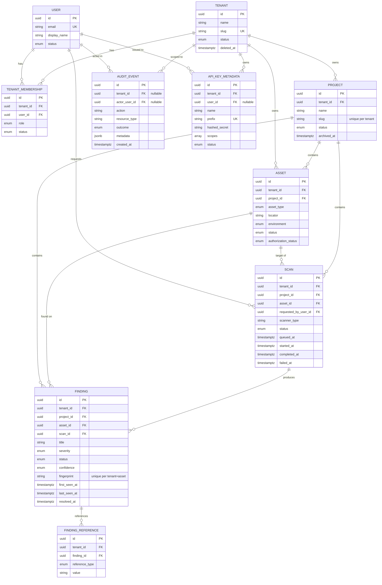

# Data Model

Ten entities, implemented in `backend/app/models/`. This document covers
ownership, relationships, and the policies (deletion, deduplication, audit)
that aren't obvious from the column list alone.

## Entity-relationship diagram

## Ownership

- **Tenant** is the root — not itself owned by anything.
- **User** is a global identity, *not* tenant-owned. Tenancy is entirely
  mediated through **TenantMembership**.
- **Project**, **Asset**, **Scan**, **Finding**, **FindingReference**, and
  **APIKeyMetadata** are all tenant-owned (`tenant_id` on every row).
  **AuditEvent** is *optionally* tenant-scoped (`tenant_id` nullable) —
  platform-level events (e.g. a login attempt before any tenant context
  exists) have no tenant.
- Ownership chains downward: Project → Asset → Scan → Finding →
  FindingReference. Each level's `tenant_id` is **DB-enforced** to match
  its parent's, via composite foreign keys — see
  [`tenant-isolation.md`](tenant-isolation.md) for exactly how and why.

## Deletion policy

- **No hard-delete path exists in the repository layer** for
  Tenant/Project/Asset — `Tenant.status`, `Project.archived_at`,
  `Asset.status` are how you retire something. This is deliberate: none of
  the tenant, project, or asset repositories expose a `delete()` method.
- Every foreign key defaults to `ON DELETE RESTRICT`: a hard delete (issued
  directly against the database, bypassing the application) is blocked if
  dependent rows exist, rather than silently cascading data loss.
- Two documented exceptions:
  - `FindingReference.finding_id` → `findings` is `ON DELETE CASCADE`. A
    reference has no meaning independent of the finding it annotates.
  - `AuditEvent.tenant_id` and `AuditEvent.actor_user_id` are nullable with
    `ON DELETE SET NULL`, and `Scan.requested_by_user_id` likewise. History
    (audit trail, past scan records) must outlive the entities it
    references, not be deleted with them or block their deletion.

## Finding deduplication

A finding is uniquely identified by `(tenant_id, asset_id, fingerprint)`
(enforced by a unique constraint, `uq_findings_tenant_id_asset_id_fingerprint`).
`fingerprint` is a deterministic hash of the tool's stable identity for the
issue (rule ID + locator + normalized detail) — computing it is the scan
engine's responsibility, not persisted here.

`FindingRepository.record_detection()` implements the policy:

- **New fingerprint** → insert a new row; `first_seen_at` and
  `last_seen_at` both default to now.
- **Fingerprint already seen on this asset** → update the *existing* row's
  `last_seen_at` and `scan_id` (pointing at the most recent detecting
  scan). `first_seen_at` is **never** modified after creation.

`status`/`severity`/`confidence` are mutable — that's the point, analysts
triage findings over time. What must never happen is silently losing the
fact that a finding was first observed on a given date, or its scan
history disappearing; the *trail* of status changes over time is what
`AuditEvent` (append-only, see below) is for, not the `Finding` row itself.

## Audit policy

`AuditEvent` is append-only by construction, not just convention:

- The model uses `CreatedAtMixin`, not `TimestampMixin` — there is no
  `updated_at` column at all.
- `AuditEventRepository` exposes only `create()` and `list_by_tenant()` —
  no `update()`, no `delete()`.
- `event_metadata` (JSONB; the Python attribute is renamed from the DB
  column `metadata` because `metadata` is reserved on SQLAlchemy
  declarative classes) is capped at 8 KiB, enforced by both a DB
  `CHECK (pg_column_size(...) <= 8192)` and a matching Pydantic validator
  on `AuditEventCreate` for fast, pre-flight feedback.
- Survives deletion of the tenant/user it references (`ON DELETE SET NULL`)
  — see Deletion policy above.

## Secrets

- `APIKeyMetadata.hashed_secret` is the only credential-shaped field in
  this schema, and it is never a plaintext key — the field name says so,
  and `APIKeyMetadataRead` (the schema every future API response would use)
  doesn't include it at all, not even redacted.
- No password field exists anywhere on `User` — authentication is a later
  phase.
- `Asset` has no secret/credential field of any kind in this phase.

## Migration workflow, local commands, test workflow

See [`local-development.md`](local-development.md).
